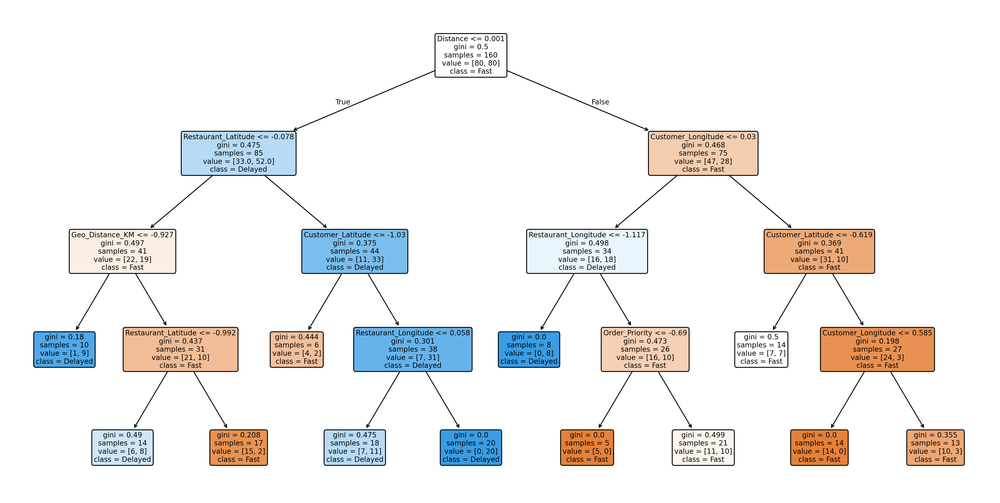

# 🚚 Food Delivery Status Classification System

## 🧠 Fast vs Delayed Delivery Prediction using Machine Learning Classification Algorithms

---

## 👤 Author

**Sagnik Patra**

---

## 📌 Project Overview

This project builds an end-to-end **Food Delivery Status Classification System** using Machine Learning techniques to predict whether a food order will be delivered **Fast** or **Delayed**.

The system uses delivery-related features such as customer location, restaurant location, weather conditions, traffic conditions, vehicle type, ratings, order cost, and delivery distance to classify delivery performance.

A geographic distance feature is generated using the **Haversine Formula**, allowing the model to understand real-world travel distance between customers and restaurants.

The project implements and compares three classification algorithms:

- Gaussian Naive Bayes
- K-Nearest Neighbors (KNN)
- Decision Tree Classifier

The system automatically performs preprocessing, feature engineering, hyperparameter tuning, evaluation, visualization generation, model comparison, and report generation.

---



---

## 🎯 Objectives

- Predict whether a delivery will be **Fast** or **Delayed**
- Handle missing values through imputation
- Encode categorical variables
- Normalize numerical features
- Calculate geographic distance using latitude and longitude
- Create binary delivery status categories
- Train and evaluate multiple classification algorithms
- Compare model performances
- Generate visual analytics and reports
- Identify factors influencing delivery delays

---

# 📂 Dataset

Dataset Used:

```text
Food_Delivery_Time_Prediction.csv
```

The dataset contains information such as:

| Feature | Description |
|----------|------------|
| Order_ID | Unique order identifier |
| Customer_Location | Customer latitude and longitude |
| Restaurant_Location | Restaurant latitude and longitude |
| Distance | Delivery distance |
| Weather_Conditions | Weather during delivery |
| Traffic_Conditions | Traffic status |
| Delivery_Person_Experience | Experience level of delivery agent |
| Order_Priority | Priority of order |
| Order_Time | Time of order placement |
| Vehicle_Type | Vehicle used |
| Restaurant_Rating | Restaurant rating |
| Customer_Rating | Customer rating |
| Delivery_Time | Actual delivery time |
| Order_Cost | Order value |
| Tip_Amount | Customer tip |

---

# ⚙️ Project Workflow

## Phase 1: Data Preprocessing

### Data Import

- Load Food Delivery dataset
- Explore dataset structure
- Remove duplicate records

### Missing Value Handling

Numerical Features:

```python
SimpleImputer(strategy="mean")
```

Categorical Features:

```python
SimpleImputer(strategy="most_frequent")
```

### Categorical Encoding

Label Encoding is applied on:

- Weather Conditions
- Traffic Conditions
- Vehicle Type
- Order Priority
- Other categorical attributes

```python
LabelEncoder()
```

### Feature Scaling

Continuous variables are normalized using:

```python
StandardScaler()
```

---

# 🌍 Geographic Feature Engineering

## Haversine Distance Calculation

Customer and restaurant coordinates are extracted and converted into a meaningful geographic distance.

Formula:

```text
a = sin²(Δlat/2) +
    cos(lat1) × cos(lat2) × sin²(Δlon/2)

c = 2 × atan2(√a, √(1−a))

Distance = R × c
```

Where:

- R = Earth's radius (6371 km)

Generated Feature:

```text
Geo_Distance_KM
```

---

# 🏷 Target Variable Creation

The project converts delivery time into a binary classification problem.

### Delivery Status

```python
Delivery_Time > Median_Time
```

| Class | Label |
|---------|---------|
| 0 | Fast |
| 1 | Delayed |

This creates balanced delivery categories for classification.

---

# 🤖 Machine Learning Models

## 1️⃣ Gaussian Naive Bayes

### Description

Gaussian Naive Bayes assumes features follow a normal distribution and predicts delivery status based on probabilistic relationships.

### Advantages

- Fast training
- Low computational cost
- Works well on small datasets

### Evaluation Metrics

- Accuracy
- Precision
- Recall
- F1 Score
- Confusion Matrix
- ROC Curve

---

## 2️⃣ K-Nearest Neighbors (KNN)

### Description

KNN predicts delivery status using neighboring delivery instances.

### Hyperparameter Tuning

Grid Search Cross Validation:

```python
GridSearchCV()
```

Parameters:

```python
n_neighbors
weights
metric
```

### Evaluation Metrics

- Accuracy
- Precision
- Recall
- F1 Score
- Confusion Matrix
- ROC Curve

---

## 3️⃣ Decision Tree Classifier

### Description

Decision Tree learns delivery patterns through hierarchical decision rules.

### Hyperparameter Tuning

```python
max_depth
min_samples_split
min_samples_leaf
criterion
```

### Advantages

- Highly interpretable
- Captures non-linear relationships
- Provides feature importance

### Evaluation Metrics

- Accuracy
- Precision
- Recall
- F1 Score
- Confusion Matrix
- ROC Curve

---

# 📊 Performance Evaluation

Each classifier is evaluated using:

## Accuracy

```text
(TP + TN) / Total Predictions
```

## Precision

```text
TP / (TP + FP)
```

## Recall

```text
TP / (TP + FN)
```

## F1 Score

```text
2 × Precision × Recall
------------------------
 Precision + Recall
```

## Confusion Matrix

Provides:

- True Positives
- True Negatives
- False Positives
- False Negatives

## ROC Curve

Measures classification capability across thresholds.

## Area Under Curve (AUC)

Higher AUC indicates better performance.

---

# 📈 Visualizations Generated

The project automatically generates:

### Confusion Matrix Visualizations

```text
Naive_Bayes_confusion_matrix.png
KNN_confusion_matrix.png
Decision_Tree_confusion_matrix.png
```

### ROC Curves

```text
Naive_Bayes_roc_curve.png
KNN_roc_curve.png
Decision_Tree_roc_curve.png
```

### Model Comparison

```text
model_performance_comparison.png
```

### Feature Importance

```text
decision_tree_feature_importance.png
```

### Decision Tree Structure

```text
decision_tree_visualization.png
```

---

# 📁 Generated Files

## Processed Data

```text
preprocessed_scaled_food_delivery_data.csv
```

## Prediction Results

```text
food_delivery_predictions.csv
```

## Model Metrics

```text
model_comparison_results.csv
```

## Feature Importance

```text
decision_tree_feature_importance.csv
```

## Final Report

```text
final_food_delivery_classification_report.md
```

## JSON Summary

```text
result_summary.json
```

---

# 💾 Saved Models

The project stores trained machine learning models:

```text
naive_bayes_model.pkl
knn_model.pkl
decision_tree_model.pkl
```

Additional files:

```text
standard_scaler.pkl
label_encoders.pkl
```

---

# 🛠 Technologies Used

## Programming Language

- Python 3.x

## Data Processing

- Pandas
- NumPy

## Visualization

- Matplotlib
- Seaborn

## Machine Learning

- Scikit-Learn

### Algorithms

- Gaussian Naive Bayes
- K-Nearest Neighbors
- Decision Tree

---

# 📦 Installation

Clone Repository

```bash
git clone https://github.com/your-repository/Food-Delivery-Status-Classification.git
```

Move into Project Folder

```bash
cd Food-Delivery-Status-Classification
```

Install Dependencies

```bash
pip install pandas numpy matplotlib seaborn scikit-learn joblib
```

---

# ▶️ Run Project

Open Jupyter Notebook:

```bash
jupyter notebook
```

Run:

```text
Food_Delivery_Status_Classification.ipynb
```

or execute Python script:

```bash
python food_delivery_classification.py
```

---

# 📋 Expected Output

The system will:

✅ Load and preprocess delivery data

✅ Generate geographic distance features

✅ Create Fast vs Delayed classes

✅ Train Naive Bayes model

✅ Train optimized KNN model

✅ Train optimized Decision Tree model

✅ Generate confusion matrices

✅ Generate ROC curves

✅ Compare model performance

✅ Save trained models

✅ Generate reports and visualizations

---

# 🔍 Key Insights

### Naive Bayes

- Fastest model
- Computationally efficient
- Good baseline classifier

### KNN

- Learns local delivery patterns
- Sensitive to scaling
- Performance depends on optimal K value

### Decision Tree

- Highly interpretable
- Identifies important delay factors
- Suitable for business decision-making

---

# 🏆 Recommended Model

The best model is selected automatically based on:

```text
Highest F1 Score
```

Recommendation criteria:

- Accuracy
- Precision
- Recall
- F1 Score
- Interpretability

For operational deployment, **Decision Tree** is often preferred because it balances prediction quality with explainability.

---

# 🚀 Future Enhancements

- Random Forest Classification
- XGBoost Classification
- LightGBM Classification
- CatBoost Classification
- Real-time Delivery Prediction API
- Delivery Delay Risk Dashboard
- Geographic Heatmap Analytics
- Route Optimization Integration

---

# 📜 License

This project is intended for educational, academic, and research purposes.

---

## ⭐ If you find this project useful, consider starring the repository.
